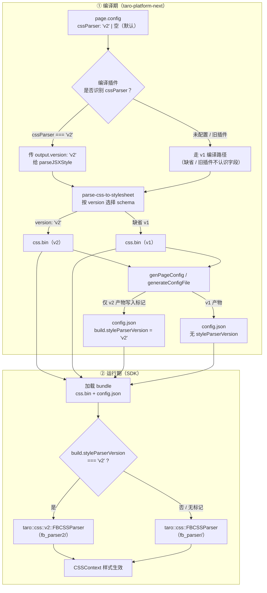
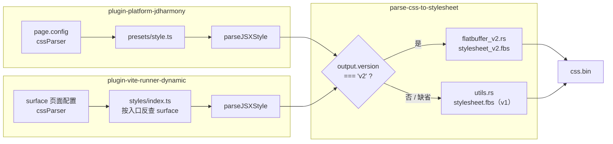
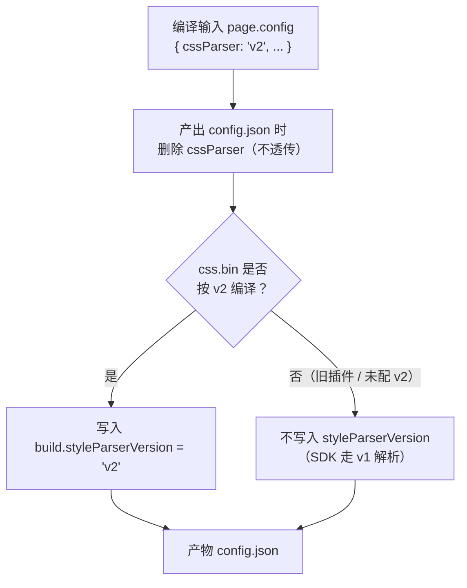
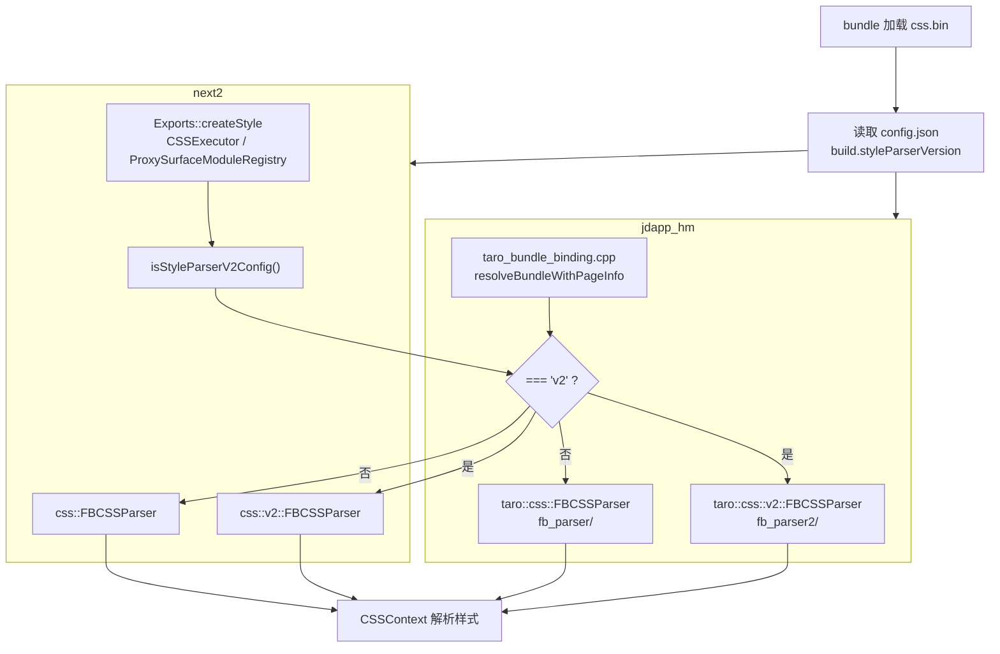
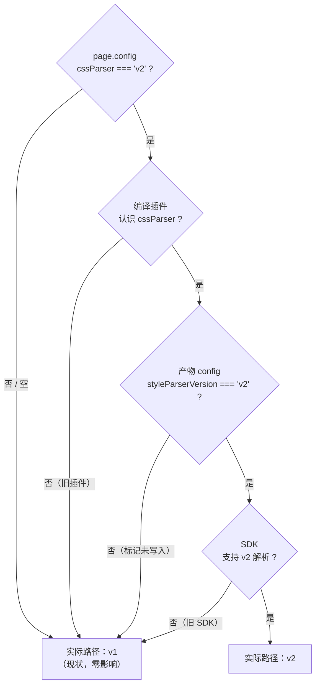

# 样式产物 Flatbuffer V2 优化技术方案（评审稿）

## 1. 背景与问题

`parse-css-to-stylesheet` 将 CSS 编译为 flatbuffer 二进制产物（`css.bin`），由鸿蒙侧 SDK（jdapp_hm，C++）在运行时解析。现状问题：**产物体积偏大**——以 `__test__/index.styles.json` 对应的真实页面样式为例，v1 产物超过 1MB，直接推高 bundle 体积与下载成本。

## 2. 原因分析

问题出在 v1 schema（`flatbuffers/stylesheet.fbs`）的数据结构上：

- **字符串大量重复内联**：颜色值、字符串类属性值、选择器、CSS 变量等，每次出现都完整存储一份字符串。样式表中重复率极高（如 `#fff`、`flex`、`solid`、各类 class 选择器），空间浪费严重。
- **高频小对象用 table 承载**：`Selector` / `PseudoKey` / `KeyValueString` 是每条 style 都会出现的小对象，v1 用 table 存储，每个实例都要额外付出 vtable + offset 开销（flatbuffer table 每个实例约 8~16 字节固定成本）。
- **字符串包装层冗余**：字符串值还要再包一层 `table String { value:string }`，union 引用 + table 头 + 字符串本体三层开销。

## 3. 方案设计

新增 v2 schema（`flatbuffers/stylesheet_v2.fbs`，namespace `StylesV2`），与 v1 **共存**，互不影响。核心改动三点：

### 3.1 字符串池（string pool）

`StyleSheet` 增加 `string_pool:[string]`，整个产物中所有字符串**只存一份**；各引用处改用 `PoolString{ id:uint32 }`，只存 4 字节下标：

```
table PoolString { id:uint32 }        // id 为 string_pool 下标
union Value { PoolString, Integer, ... }  // 替代 v1 的 String
```

覆盖范围：declaration 字符串值、字符串数组（`StringArray` 元素改为 `[uint32]`）、选择器、CSS 变量 key/value 等。

### 3.2 高频小对象改为 struct 内联

`Selector` / `PseudoKey` / `KeyValueString` 由 table 改为 **struct**，在父向量中定长内联，省掉每个实例的 vtable/offset 开销：

```
struct Selector      { string_id:uint32; integer_value:uint8; is_string:bool }
struct PseudoKey     { integer_value:int8; bool_value:bool; is_int:bool }
struct KeyValueString{ key:uint32; value:uint32 }   // key/value 均为 string_pool 下标
```

### 3.3 编译侧全链路 interning

`src/flatbuffer_v2.rs` 为 v2 转换器：除字符串池外，value table、`DeclarationTuple`、declaration 向量、selector 向量等也全部做 interning（相同内容只序列化一份，多处引用），进一步去重。

## 4. 效果数据

以真实页面样式产物（3257 条 style）实测：

| 指标 | v1 | v2 | 变化 |
|---|---|---|---|
| 产物体积 | 1,140,064 B | 504,112 B | **-55.8%** |
| 运行时解析耗时 | ~2.5 ms | ~2.5 ms | 持平 |
| 运行时内存 | 持平 | 持平 | — |

结论：**收益纯在体积**。新旧解析器 CPU/内存基本持平（v2 多一次 pool 下标寻址，但省掉大量字符串逐条拷贝，两者抵消），这符合预期——本次优化目标就是包体积。

## 5. 兼容与灰度方案

v2 不能直接替换 v1：SDK、编译插件、页面配置任一环节是旧版本时都必须能正常回落。因此采用"**编译开关 + 产物标记 + 运行时分流**"三段式：

### 流程概览



> **三段式职责**：`cssParser` 是编译输入开关（页面级灰度）；`styleParserVersion` 是产物真实标记（防"配了 v2 但编译机未升级"的错配）；SDK 只读产物标记分流，不读页面原始配置。

### 5.1 编译开关（taro-platform-next 编译插件）

- 页面配置文件（page.config）增加 **`cssParser: 'v2'`** 字段（string，**默认空**），页面级开关，可按页面灰度。
- 两个平台的编译入口都读取页面配置，`'v2'` 时传 `output.version: 'v2'` 给 `parseJSXStyle`：`plugin-platform-jdharmony`（`src/runner/presets/style.ts`，直接读 `page.config`）与 `plugin-vite-runner-dynamic`（`src/styles/index.ts`，dynamic 平台的样式编译入口在此包，按页面入口反查 surface 配置；主入口与动态 chunk 的 css.bin 跟随所属页面）。`parse-css-to-stylesheet` 的 `OutputOptions` 新增 `version?: string`，`'v2'` 走新 schema，**缺省走 v1**。



### 5.2 产物标记（防版本错配）

编译产出 `config.json` 时：

- **删掉**输入侧的 `cssParser`（它只是编译开关，不透传到产物）；
- 仅当值为 `'v2'` 时写入 **`config.build.styleParserVersion = 'v2'`**：
  - jdharmony：`genPageConfig`（`src/program/template/page.ts`）
  - dynamic：`generateConfigFile`（`plugin-vite-runner-dynamic/src/generateConfig.ts`）

为什么要一个独立的产物标记，而不是直接透传配置字段？防止这种错配：页面配了 `cssParser: 'v2'`，但编译机上的 taro-platform-next 没升级到含 v2 编译入口的版本——此时样式产物实际还是 v1。SDK 只认"产物里真实写入的标记"，即"这个产物确实按 v2 编译过"，而不是"页面想要 v2"。字段命名 `styleParserVersion` 并与输入字段区分开，放在 `build` 下（编译产物配置块的语义惯例）。



### 5.3 运行时分流（SDK）

- **jdapp_hm**：新增解析入口 `TaroCSS/parser/fb_parser2/`（与 `fb_parser` 平级，类名保持一致、置于 `namespace taro::css::v2`）：`FBCSSParser` / `FBRuleParser` / `FBMediaParser` / `FBKeyframesParser` / `FlatBuffers2AttributeResolver`，另加 `FBStringPool.h`（pool 下标取字符串，**越界返回空串**兜底）。`exports/taro_bundle_binding.cpp` 的 `resolveBundleWithPageInfo`：读产物 config 的 `build.styleParserVersion == "v2"` → 走 `taro::css::v2::FBCSSParser`，否则走旧 `FBCSSParser`。DEV / release 两条路径均已覆盖。
- **next2**：`Exports::createStyle` 按 `isStyleParserV2Config(bundle->getConfig())` 分流 `css::v2::FBCSSParser` / `css::FBCSSParser`，覆盖 addStyleRegistry 回调与 addStyleData/loadStyleData（含动态 import、BundleCSSCache）全部产物入口；分流标记约定与 jdapp_hm 完全一致。



### 5.4 回退矩阵

| 页面配置 cssParser | 编译插件 | SDK | 实际路径 |
|---|---|---|---|
| 未配置（默认空） | 任意 | 任意 | v1（现状，零影响） |
| `'v2'` | 旧版（不认识该字段） | 任意 | v1（字段被透传但 SDK 不认这个位置；标记不会被写入，走旧解析） |
| `'v2'` | 新版 | 旧版（不认标记） | 旧 SDK 不读标记 → 不生效，需 SDK 同步升级 |
| `'v2'` | 新版 | 新版 | **v2** |



## 6. 涉及仓库与改动清单

- **parse-css-to-stylesheet**（本仓库）
  - 新增 `flatbuffers/stylesheet_v2.fbs`、`src/flatbuffer_v2.rs`、`src/stylesheet_v2_generated.rs`、`flatbuffers/stylesheet_v2_generated.h`
  - `OutputOptions` 新增 `version?: string`；v1 路径（`stylesheet.fbs` / `src/utils.rs`）与 HEAD 完全一致，零改动
  - flatbuffers crate 精确 pin `25.2.10`，生成代码统一用 flatc 25.2.10 生成
- **taro-platform-next**（编译插件，jdharmony 与 dynamic 两个平台均已接入）
  - jdharmony：`src/runner/presets/style.ts` 读取页面配置 `cssParser` 传入编译入口；`src/program/template/page.ts` 写入产物标记 `build.styleParserVersion`；`src/types/plugin.ts` 的 `TPageMeta.config` 增加 `cssParser?: string`
  - dynamic（样式编译入口在 `plugin-vite-runner-dynamic`）：`src/styles/index.ts` 按页面入口反查 surface 读取页面配置 `cssParser` 传入编译入口（主入口与动态 chunk 的 css.bin 均覆盖）；`src/generateConfig.ts` 写入产物标记；依赖 `@tarojs/parse-css-to-stylesheet` 升至 1.2.0
- **jdapp_hm**（C++ SDK）
  - 新增 `TaroCSS/parser/fb_parser2/`（12 个文件）
  - `exports/taro_bundle_binding.cpp`：按产物标记分流解析器
  - `CMakeLists.txt`：fb_parser2 加入编译与 install
- **next2**（C++ SDK，iOS/Android/Harmony 多端）
  - `packages/TaroCSS/parser/fb_parser2/`：在已有移植基础上做了两类修正——
    - **接口对齐 v1**：各 parser 的 context 参数从 `CSSContext*` 放宽为 `CSSContainer*`（v2 实际只用了 CSSContainer 层的接口），`FBCSSParser` 与 v1 同构（`std::weak_ptr<CSSContainer>` + `init(const std::vector<uint8_t>&)`），使其能覆盖 CSSCache 路径
    - **逻辑对齐 v1**：`generateCount_` 改为只在 `FBCSSParser::init` 自增一次（原 v2 在 `FBRuleParser::parser` 里自增，导致 media 与 rule 读到的计数不一致）；恢复 `versionTop = generateCount_ * 10000` 及 `CSSRule(..., versionTop + mediaId)` 的版本号权重；恢复 `CSSDeclaration(styles->size())` 预分配、`getModifyTValueFun()` 钩子、`std::move(tValue)`；verify 失败与 v1 一致抛 `std::runtime_error`。FBMediaParser/FBKeyframesParser/FlatBuffers2AttributeResolver 经逐行 diff 确认与 v1 逻辑等价
  - `packages/TaroStyle/cssom/Exports.h/.cpp`：两个 `createStyle` 重载新增 `useV2Parser` 参数按标记分流；新增模板 helper `isStyleParserV2Config` 读取产物 config.json 的 `build.styleParserVersion`
  - `packages/TaroExecutor/CSS/CSSExecutor.cpp`（addStyleRegistry 回调）与 `ProxySurfaceModuleRegistry.cpp`（addStyleData/loadStyleData 共 4 处调用点）：从 `bundle->getConfig()` 读取标记并透传

## 7. 验证情况

- 本仓库：`cargo test` 4 项（v1×2 + v2×2）、`ava` 42 项、napi build、双版本产物 e2e 校验，全部通过
- 编译插件：jdharmony `page-config` 单测 3 用例、dynamic `generateConfig` 单测 3 用例通过；dynamic 全量 68 用例（含 build/dev 快照工程）通过；jdharmony 快照测试 5 个失败为既有噪声（快照录制于 1.23.0-alpha.5，diff 仅 index.js banner 版本号与 md5，css.bin/config.json 字节不变）
- SDK（jdapp_hm）：fb_parser2 与分流代码经 OHOS 真实工具链（DevEco clang++ aarch64-linux-ohos）语法检查零错误；并用新旧解析器分别跑新旧产物实测性能（见第 4 节）
- SDK（next2）：fb_parser2 全部源文件经 clang++ 语法检查零错误（外部依赖以空桩替代）；v2 与 v1 解析器已逐文件 diff 核对，逻辑差异（generateCount_/versionTop/modifyTValueFun 等）全部对齐；Exports/CSSExecutor/ProxySurfaceModuleRegistry 的分流接线因本地缺少 folly/boost 完整构建环境未做全量编译，需 CI 构建兜底

## 8. 风险与注意事项

- **版本依赖顺序**：需先发 `parse-css-to-stylesheet` 新版（1.2.0）→ 编译插件升级依赖（jdharmony / dynamic 均已升至 1.2.0）→ SDK（jdapp_hm / next2）发版，灰度页面才能切 v2。任一环节未升级时自动回落 v1，不会炸。
- **flatbuffer 版本一致性**：crate 与 flatc 必须保持 25.2.10（本机 brew 的 flatc 是 25.12.19，直接跑 `npm run flatbuffer` 会用到新版，需指定 25.2.10 的 flatc）。SDK 侧 runtime 为 24.3.25，生成头文件中的版本 static_assert 已注释。
- **解析健壮性**：v2 选择器遍历必须先判 `is_string()` 再取 pool 下标；pool 访问统一走 `poolStr` helper，越界返回空串，不会因脏数据崩溃。

## 9. 后续规划

1. 按第 8 节顺序发版后，选少量页面配置 `cssParser: 'v2'` 灰度（页面级开关，逐页面生效）；
2. 灰度稳定后逐步全量，最终评估下线 v1 链路（schema、转换器、`fb_parser`）。
